# Vision Language Models 

## Introduction

In the rapidly evolving world of artificial intelligence, vision-language pretraining stands out as a groundbreaking approach that bridges the gap between visual and textual understanding. This innovative technique leverages large-scale datasets to train models that can interpret and generate both images and text, creating a synergy between vision and language that mimics human-like comprehension. By combining these two modalities, vision-language pretraining not only enhances the ability of AI systems to understand complex visual scenes but also enables more nuanced and context-aware interactions. In this blog, we’ll delve into the mechanics behind this transformative technology, explore its applications, and discuss the future possibilities it holds for AI-driven advancements.

## Architecture Overview
Three main components:
1. Modality encoder
2. Large-language model
3. Modality interface

### Modality encoders
* Common image encoders:
 * Self-supervised: DINO, MAE
 * CLIP
 * EVA-CLIP
* Considerations
 * key question of tokenization: beyond just classificaiton, need finer-grained
 * one SSL objective does not learn everything. One objective may learn spatial information, some semantics, etc. So people try to concatenate everything
 * Higher resolution inputs improve performance. Multi-resolution methods

### Large-language models
* Popular options
 * Flan-T5
 * LlaMA
 * Vicuna
 * Wen
* Considerations
 * Free vs cost
 * Larger tend to perform better

### Modality-interfaces

* Token-level fusion: these methods aim to create a unified representation that captures the interactions between vision and language tokens. "tokens" refer to discrete units of information from each modality. For language, tokens are typically words or subwords, while for vision, tokens are often features extracted from image patches or regions. There are multiple ways to combine language and vision tokens.
    * Cross-Attention Mechanisms allows the model to align and integrate visual and textual tokens by attending to one modality's tokens while considering the other modality’s tokens.
        * Visual Tokens Attend to Textual Tokens: When processing visual tokens (e.g., image patches), the model can use attention mechanisms to focus on relevant textual tokens (e.g., words in a caption).
        * Textual Tokens Attend to Visual Tokens: Conversely, textual tokens can attend to visual tokens to derive context or meaning related to specific visual features.
    * Token Alignment. Token alignment involves mapping visual tokens to textual tokens and vice versa. This alignment ensures that each visual token corresponds to a relevant textual token and helps in learning how visual features relate to textual descriptions. Techniques include:
        * Bilinear Pooling: Combining features from visual and textual tokens through bilinear pooling to capture interactions.
        * Attention Maps: Using attention maps to align and fuse features from both modalities
    * Joint Embedding Spaces: Token-level fusion can be achieved by projecting both visual and textual tokens into a shared embedding space. This shared space enables direct comparison and interaction between visual and textual tokens. 
        * Multimodal Transformers: Transformers that process both visual and textual tokens in a unified architecture, learning joint representations through self-attention and cross-attention layers.
    * Feature Concatenation. Visual and textual tokens can be concatenated or combined into a single representation before further processing. This approach integrates features from both modalities at each token level:
        * Concatenation: Directly concatenating features from visual and textual tokens and feeding them into subsequent layers.
        * Sum or Average Fusion: Summing or averaging features from both modalities to create a combined representation.
    * Linear projection (LlaVa)
    * Query-based like Q-Former (BLIP-2)

* Feature-level fusion:
    * Cross-attention layers (Flamingo)
    * Visual expert modules (CogVLM)

* Comments
    * Connection modules typically account for small percentage of parameters 

## Training stages
1. Pre-trainng of vision and language models
    * Collect examples of (instruction, output) pairs across many tasks and finetune an LM, then evaluate on unseen tasks
    * Goal: align modalities and learn multimodal knowledge.
    * Data; mostly large volumes of image-text pairs. 
    * Datasets: CC3M, LAION-5B, COYO-700M, or GPT-4V for generating fine-grained data
    * why: Need to do to avoid biases/hallucination from data and LM
2. Instruction tuning 
    * Goal: teach models to follow multimodal instructions
    * Data collection methods:
        * Adapting existing datasets
        * Self-instruction: use a LLM to expand the instructions
        * Mixing language-only and multi-modal data
    * LlaVa-instruct: bounding boxes/captions -> GPT4 -> more data
    * Data quality is important
3. Alignment tuning
    * Goal: align outputs with human preferences
    * Reinforcement Learning with Human Feedback (RLHF)
    * Direct Preference Optimization (DPO)
    * Key papers:
4. Prompting
    * Zero-shot prompting is common
    * In-context evalaution is an interesting area
        * less studied in multi-modal space 
5. Evaluation methods
    * Closed-set: task-specific datasets and metrics
        - MME/MMBench
        - Video-ChatGPT, Video-bench
    * Open-set:
        - mPLUG-Owl: visually related evaluations, diagrams, flowcharts, etc.
    * Autoevaluation common: GPT scoring

# Literature Review 

## ViLT

**Discussion**
* What does the pooling layer do?
* How to train word-patch alignment if no labels?

## FLAVA (CVPR, 2024)

**keywords**: foundational model, simple framework

**Problem Statement**
* Existing models are either cross-modal (constrastive) or multimodal (earlier fusion) but not both, and only target specific tasks
* Aim to use a single holistic universal "foundational" model that targets all modalities at once, and is good at vision-only, language-only, and vision-language tasks

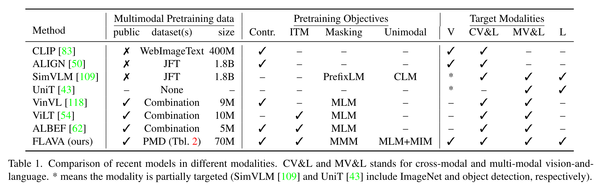

**Related Works**
* Single target domain: ViLT, VinVL
* Specific unimodal domain: ALIGN, CLIP

Unit
* Key: Unified transformer encoder-decoder arch
* Arch: 
    * Image encoder, text encoder use the same ViT arch
    * Joint decoder with per-task query embedding followed by task-specfici heads 
    * Concatenate output from image encoder, text encoder as inputs into a decoder 
* Fusion:
    * Multi-head cross-attention in decoder
* Task heads:
    * detection class & box heads 
    * VQA classifier
    * ...
* Pro:
    * 
* Cons:
    * Image and text may not be well aligned compared to contrastive learning

ALBEF (2021)
* Key: "Align before Fuse", first aligning visual and tex features before fusing them 
    * previous works fuse modalities early which may result in suboptimal representations 
* Image encoder, text encoder, multimodal encoder 
    * 
* Contrastive learning loss:
    * image-text contrastive loss
* Momentum model
    * A teacher model to distill information 
    * 
* Tasks:
    * ITM
    * MLM 

**Approach**
* Model Arch
    * Image encoder: ViT-B/16 
    * Text encoder: *same* ViT arch with visual encoder 
    * Multimodal encoder: a separate ViT to fuse modalities with two learned linear projections
    * CLS tokens
        * Image classification token *[CLS_I]*
        * Text classification token *[CLS_T]*
        * Multimodal classification token *[CLS_M]*
        * These tokens are used in the task heads to conveniently perform downstream tasks, such as image classification
    * Unimodal and multi-modal task heads
        * Vision task heads
        * NLP task heads
        * Multimodal task heads
* Training objectives
    * Unimodal objectives:
        * Masked image modeling (MIM): loss on image encoder
        * Masked language modeling (MLM): loss on text encoder
        * Encoder initialized from unimodal pretraining
            * First used DINO objective then switched MIM 
    * Multimodal objectives:
        * Global contrastive (GC) loss
            * In paralell computing, samples are split across multiple GPUs.
            * CLIP only backpropagates the gradients of the contrastive loss to the embeddings from the local GPU
            * FLAVA does full backpropagation across GPUs and observe noticeable improvement
        * Masked multimodal modeling (MMM): masks both image patches and text tokens 
        * Image-text matching (ITM)
        * [Trick] Used pretrained dVAE tokenizer for MMM and MIM to tokenize image
            * In dVAE, input is a text description and output is a generated image that matches text description
            * Can generate images from text input in a "zero-shot" manner, meaningful the model can handle unseen categories tha twere not part of its training data. Can be seen as a "codebook" that finds patches most similar to a text
* Joint uni and multimodal training
    * Step 1: Unimodal pretraining of image and text encoders
    * Step 2: Train the whole FLAVA model on three types of datasets with round-robin sampling
    * [Trick] *Round-robin sampling*: sample and losses take turns to train the model 
* Implementation details
    * large batch size
    * large weight decay
    * long warm-up

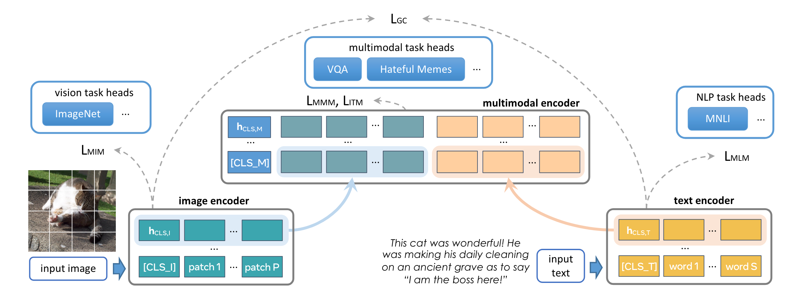

**Results**
Experiments on 22 visual classification datasets, 8 language tasks, and multimodal tasks.
* FLAVA signficantly surpassed CLIP that is pretrained on the same dataset
* Surpassed other SOTA (because FLAVA is trained on 70M)
* BERT is still the best on language-only tasks (unfair comparison because BERT is unimodal)

Ablation study insights:
* The global contrastive loss is effective. Global loss of all GPU better than local GPU
* MMM and ITM objectives benefit multimodal tasks
* Joint unimodal and multimodal pretraining helps NLP
* Unimodal pretraining provides better image and text encoders
* DINO better than BEiT for initialization

**Discussion**
* Cons
    * did not discuss computational resources 
    * Training complexity
    * Model still fine-tuned to downstream tasks, not zero-hot (old school)
* Relationship with other works:
    * Improved large-scale pretraining of CLIP and ALIGN by incorporating unpaired image and text
    * Advanced

* Q: Why use the same ViT arch  for text encoder?
    * easier to have image/text in the same embedding space 
    * convenience in terms of computational resources
    * maybe other reasons? 

* Q: How is the multi-task training done?
    * There is a lot of research in task-balancing. You could have conflicting tasks with gradients pointing to different directions
    * Unimodal pretraining is common to start from a good initialization and stablize losses 
    * Large batch size really matters

* Q: Is this really a unified model?
    * One vision of unified is the same model arch that you can through tokens and get general embeddings. But here, for different tasks you use different embeddings. It is more like a big multi-task model where different parts do different things. 
 

## Frozen 

**Key idea**
* LLMs can learn to perform new tasks WITHOUT any gradient updates
* Showed that this capabilty can extend LLM to multimodal settings

**Related Works**
* **VL-Bert** (2019): BERT backbone remains the same, extracts image ROIs with Faster RCNN for fine-grained features
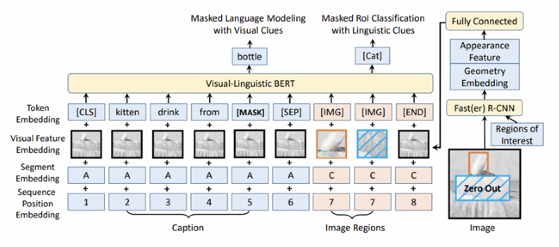
* ***WiLBert** (2019): Model consists of two parallel BERT models (one for images, one for text) which max information in co-attention blocks 
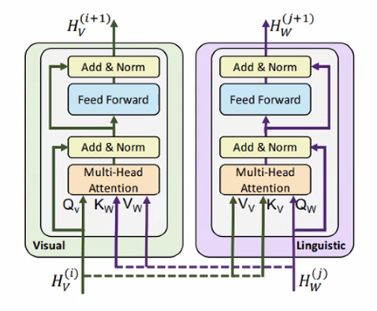
* Limitation: Both models performed well on multimodal tasks (VQA, captioning) but were task-specific. 
    * Frozen aims to tackle this and have a model that can generalize to a wide range of tasks
* Pretrained Transformers As Universal Computation Engines (2021)
    * Explored transferring LLM backbones to entirely new tasks by only tuning input, output, and layer norms (<0.1% of network parameters)
    * Example tasks: bit string memory and XOR; list operations; MNIST and CIFAR-10; protein fold prediction 
    * Models can achieve surprising performance on all tasks compared to fully-trained models! 
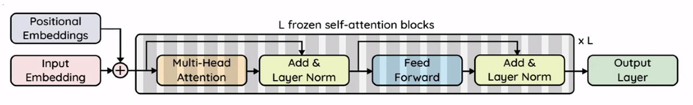
* The Power of Scale for Parameter-Efficient Prompt Tuning (2021)
    * Prompt tuning: add tokens generated by tuneable parameters to each input; 
    ...
* Prefix-Tuning: Optimizing continuous prompts for generation (2021)
    * Very similar to prompt tuning, but with one key difference:
        * Prompt: tokens added to inputs
        * Prefix: tokens added to inputs and all intermediate layers
    * A separate network is learned to generate prefixe 
    * Frozen: can be seen as image-conditional prefix-tuning 

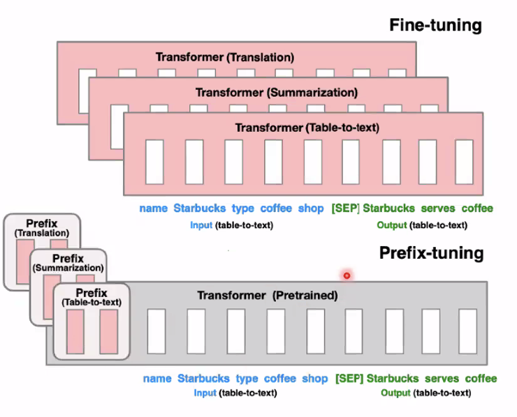

**Approach**
* Simple architecture:
    * A completely frozen LLM
    * Convert image with ResNet50 into 2 tokens (~prefix tuning)
    * Gradient flows through LLM
* Fine-tuning 0 hurts generalization, because the LM dataset size is much larger than text-image paired data
* Modularity: plug-n-play any LLM
* Proof of concept: small scale (7B model) but enough to show interesting properties for few-shot
* Training objective: data of only one image is needed to predict caption of this image. At inference, multiple images are supported 

**Results**
* Encyclopedic Knowledge and Outside-Knowledge VQA:
    * 

**Discussion**
* Strengths
    * An interesting concept that serves as a baseline for future multimodal few-shot learners
    * Design is modular and could be easily extended to additional modalities
    * Re-creating the paper requires little training
* Limitations
    * Far from SOTA
    * unexplored question: could performance be improved with more elaborate architectures for mixing vision and language?
    * The model is compared to very few baselines
    * The author-defined characteristics of a multimodal few shot learners are arbitrarily chosen 
    * Frozen still performs pooly at tasks measuring these capabilities  

## Flamingo
**Related Works**
* TODO 
* **Chinchilla**:
    * SOTA accuracy on MMLU (exam-like quesitons on academic subjects)
    * Scaled training tokens at the same rate as model size

**Approach**
* Vision encoder (pretrained and frozen)
    * Input-output: From pixels to features
    * Architecture is noarmalizer Free ResNet (NFNet)
    * Trained on datasets of image and text pairs using contrastive loss
* Perceiver Resampler (trained from scratch)
    * Input-output: From varying-size large feature maps to few visual tokens
    * Intuition: you can through more tokens in with the same number of tokens out. Works as a token reducer. 
* Gated cross-attention dense laters (trained from scratch): inserted into LM
    * Use of tanh and initialized to zero to have no effect at training beginning 
* Text input interleaved with image
* Visually-conditioned autoregressive text generation

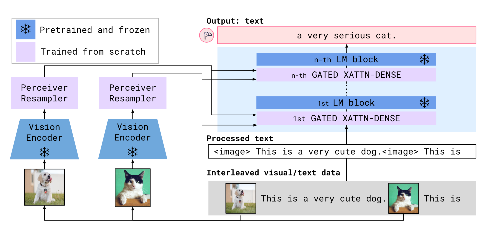

**Discussion**
* Limitations
    * Hallucitations
    * Poor generalization for long sequences
    * Worse than contrastive models in classification
    * Sensitivity to examples
    * Text interface inconvenient for some tasks
    * Expensive to train

## LLaVA

**Related Works**
* Instruction Tuning:
    * Goal: improvem model generalizability by trianing them to follow instructions and complete tasks in the wild, using zero or few-shot learning
    * Intuition: there is a large pre-trained, general-purpose model with "world knowledge". You want to perform a specific task at hand. You try to extract knoweldge from this pre-trained model by changing the way to interact with the model to get the knowledge that is helpful for your task. 
    * Existing works:
        * Text-only:
            * Template-based (Flan)
            * API prompts (InstructGPT)
            * Model-generated (Alpaca)
            * Human-model conversation (Vicuna)
        * Multimodal:
            * Model-generated text + retrieved image: OpenFlamingo
            * Model-generated: LLaVA

**Apporach**
* Instruction Tuning
    * Using text-only GPT-4 to expand COCO to instructions
    * Response types:
        * Conversation: for few-shot in-context learning 

**Discussion**
* Strengths 

* Limitations
    * Malicious input, how to handle
    * Hallucinations
    * Data efficiency
    * Sensitive to model/data biases 
    * Prolonged training process and extra compute when trained on higher-resoluion images
    * Still struggles to fully ouperform domain specific fine-tuned models
        

## Unified-IO (2024, CVPR)

**Contributions**
* Set the new SOTA on the GRIT benchmark
    * NOTE: GRIT is very low-level vision (segmentation)
* Capable of following free-form instructions, even those unseen during training 
* Matched or outperformed recently proposed VLMs

**Related Works**
* MiniGPT-v2, IntructBLIP: 
* [CODI](https://codi-gen.github.io/): Any-to-Any Generation via Composable Diffusion
    * A generative model capable of generating any combination of output modalities, such as language, image, video, or audio, from any combination of input modalities

    

    * Based on Latent Diffusion Modelling (LDM), that learns the distribution of the latent variable z corresponding to x, which reduces computational cost compared to standard diffusion model that learns p(x) by reducing the data dimension.

    * A novel composable generation strategy which involves building a shared multimodal space by bridging alignment in the diffusion process, enabling the synchronized generation of intertwined modalities

    * Freely condition on any input combination and generate any group of modalities, even if they are not present in the training data

    * https://arxiv.org/pdf/2305.11846 

* [Unified-IO](https://unified-io.allenai.org/): A unified Model for Vision, Language, and Multi-modal Tasks
    * 

**Approach** 
* Modality encoding
    * Text: 
        * Tokenized using byte-pair encoding from LLaMA (because it supports Unicode symbols and preserves whitespace)
    * Sparse Structures:
        * Sparse structures such as bounding boxes, keypoints, and camera poses are discretized and then encoded using 1000 special tokens added to the vocabulary
        * Points are encoded with a sequence of two such tokens (one for x and one for y)
        * Boxes are encoded with a sequence of four tokens (upper left and lower right corners)
        * 3D cuboids are represented with 12 tokens that encode the projected center, virtual depth, log-normalized box dimension, and continuous allocentric rotation
    * Action data:
        * Discrete robot actions [17] are generated as text commands (e.g., “move ahead” to command the robot to move forward in navigation). 
        * Special tokens are used to encode the robot’s state, such as its position and rotation.
    * Image: pre-trained ViT
        * Concatenated the patch features from the second and second-to-last layers of the ViT to capture both low and high-level visual information. These features are passed through a linear layer to get embeddings that can be used as part of the input sequence for the transformer
        * For image generation, used VQ-GAN to convert images into discrete tokens, which are added to the vocabulary and then used as the target output sequence in order to generate an image.
        * Represented per-pixel labels (depth, surface normals, and binary segmentation masks) as RGB images that can be generated or encoded with our image generation and encoding abilities
        * For segmentation, UNIFIED-IO 2 is trained to predict a binary mask given a class and bounding box. An entire image can be segmented by first doing detection, and then querying the model for a segmentation mask for each detected bounding box and class
    * Audio: pre-trained Audio Spectrogram Transformer (AST)
        * Encodes up to 4.08 seconds of audio into a spectrogram, the input embeddings are built by concatenating the second and second-tolast layer features from the AST and applying a linear layer just as with the image ViT
        * For audio generation, used a ViT-VQGAN (since no public model, had to train on their own)
    * Image and Audio History:
        * UNIFIED-IO 2 allows up to four additional images and audio segments to be given as input
        * Encoded using the ViT or AST, but then use a perceiver resampler to further compress the features into a smaller number of tokens (32 for images and 16 for audio). The purpose is to summarize the high-level context of history 
        * This history is used to encode previous video frames, previous audio segments, or reference images for tasks such as multi-view image reconstruction or image-conditioned image editing.
* Architecture improvements
    * The UNIFIED architecture becomes increasingly unstable when more modalities are added 
    * [RoPE: 2D Rotary Positional Embedding](https://arxiv.org/html/2403.13298v1)
        * Why: did not want to use absolute position embeddings and also wanted to be consistent with the LLaMA position encoding
        * Instead, used RoPE which uses no parameters and instead uses a kernel trick to allow the model to recover relative distances between key and query elements in a transformer’s attention head.
        * Customization: treated each token (image, audio, image history, and audio history) as having a 2-dimensional position corresponding to 1) h, w coordinates in the image or audio spectrogram, 2) (t, l) where t and l represent the indices of frame and perceiver latent vector in the image or audio history, respectively.
        * Read another blog 3_positional_encoding.md 
    * QK Normalization
    * Dynamic Packing
        * A batch that has examples of different modalities can have different number of tokens. So authors proposed to pack tokens of multiple examples into a single sequence, similar to the standard practice of padding input tensors to a maximum length
        * Problem is the attention will be computed across examples. So authors proposed to mask attention to prevent the transformer from cross-attending between examples.
        * 4x increase in training throuput 
* Pre-training on a huge dataset: 
    * Data: 1B image-text pairs, 1 trillion text tokens, 120 million video clips, 130 million interleaves image and text, 3 million 3D assets, and 1 million agent trajectories
    * Pre-training tasks:

* Instruction tuning
    * 220 tasks from over 120 datasets
    * 60% prompting data
    * To avoid catastrophic forgetting, 30% of the data is carried over from pre-trainng 
    * 6% task augmentation data built by constructing novel tasks using existing data sources

* Tasks
    * audio visual
    * 3D object detection
    * 2D detection and segmentation
    * 3D synthesis from image
    * Robot actions 

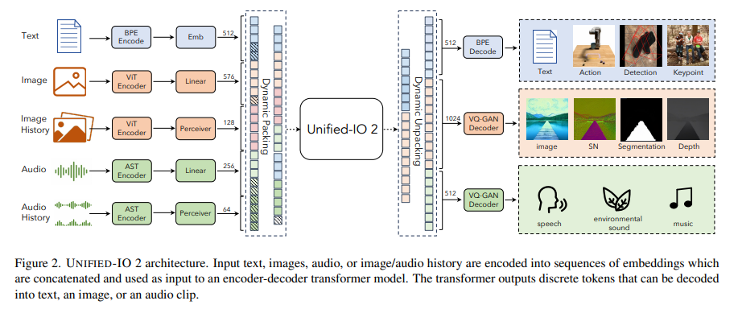

**Experiments Results**
* Zero-shot analysis: not much signal but a good start 
* Diffusion >> GAN
* Unimodal most likely wins when:
    * there are more "supervised" data and a few good "Task-specific" tricks 
    * DINO+SAM, LLAMA-7B
* Unimodal most likely lose when: 
    * not enough data and no "additional" task-specific tricks

**Discussion**
* We know that multi-modal models perform better when there is more data, and uni-modal models don't use tricks. But can we pin-point why?
* Few systematic, controlled, small-scale experiments to investigate 
* Limitations
    * Comparison with others: Only 3/8 methods are fairly compared; Only 6/10 datasets may be fairly inspected
    * Long horizon generation
    * Image quality (VQ-GAN intrinsic limitation, difficult to lower reconstruction loss with large input images)
* Implications
    * Pushes the efforts for unifying modalities into one model
    * One model for n tasks is easier to scale vs. n models for n tasks.
* Strengths
    * Logistics of unifying the 4 modalities are very well handled
    * Code, data, experiments, publcly available
    * Tasks evaluated were exhaustive and benchmarks a lot 
    * ...

# Token-level everything 

## Chameleon: Mixed-Modal Early-Fusion Foundation Models (Meta, 2024)
A *token-based*, *early fusion*, multimodal learning algorithm through *pure autoregressive* generation.

**Motivation**

**Related Works**
* Image as sequences of tokens
    * Discrete VAE (2016): a VAE restricting the latent space to be discrete tokens. However, a limitation is that the key trick to train VAE, reparameterization trick, does not work because it is not differentiable 
    * VQ-VAE (2017): a more stable pipeline levearging the idea of vector quantization. Learns a continuous latent representation for image patches, but force it to be representatble as discrete tokens through projection onto their nearest neighbors in the codebook 
    * VQ-GAN (2021): improves upon VQ-VAE by enabling the learning of a representaiton-rich codebook with additional perceptual losses and GAN losses 
    * Stable Diffusion also uses this! 
    * Intuition: Why does discrete tokens work so well in a lot of domains?
        * Continuous spaces and high-dimensional objects are hard in general
        * Sometimes too much flexibility is not the best. Discrete space restricts model's attention to more finite and important details 
* Token-based image self-supervised learning
    * BEIT:
        * Motivated by the success of BERT and masked language modelling on language tasks, BEIT attempts a similar analogy for image representation learning
        * Images are separated patches and encoded in two ywas: 1) through d-VAE into visual tokens, 2) through linear projection head into latent vectors
        * SSL task: given a image in pixel space where some patches are masked, predict the visual tokens with a vision transformer as backbone 
    * CM3 & CM3Leon (precursor work of Chameleon):
        * Extends the token-based modelling approach to multimodal data in a pure *autoregressive* fashion
        * CM3 considered a causally masked language training objective, where hyperlinks and images are replaced with a placeholder <mask> token in the middle of text generation, and they will be generated at the end of the sentence. In other words, it turns inputs into infilling instances by masking certain segments and moving them to the end, effectively transforming a multi-modal task into a text prediction one. This approach enables the model to handle infilling and autoregressive generation tasks for both images and text. 
            * For example, it can generate an image from a text prompt like “Image of a chameleon:”, or produce a caption from a masked image prompt like “Image of : [image] “.
        * CM3Leon scales up CM3 and add a second stage of SFT to align this general purpose model. 
* Early Fusion vs Late-Fusion 
    * Late fusion: data of different modalities are encoded separately with different encoders before passing to a model for fusion 
        * Ex. Flamingo, ViLT, LLaVA, Unified-IO
    * Early fusion: data of different modalities are encdoed into discrete token with a shared vocabulary, then representation are learned in a shared latent space
        * Ex. Chameleon, Show-o, Transfusion
        * Chameleon is purely autoregressive. All attention are causally masked due to always predicting the next tokens 
        * Other two works model text in a autoregressive way, but generate image tokens simultaneously. Attention are causally masked when generating text but bidirectional when generating images  

**Approach**
* Tokenization
    * Text
        * BPE tokenizer trained from sratch with a vocabulary size of 65,536, which includes the 8192 image codebook tokens
    * Image
        * Train a new image tokenizer based on Gafni et al. (2022), which encodes a 512 × 512 image into 1024 discrete tokens from a codebook of size 8192. 
        * For training this tokenizer, used only licensed images. 
        * A core weakness of this tokenizer is in reconstructing images with a large amount of text, therefore upper bounding the capability of the models when it comes to heavy OCR-related tasks.
* Architecture improvements: 
    * A uniform mixed-modal transformer to process tokens from all modalities 
    * Decoder-only model derived from Llama 2
    * RMSNorm instead of LayerNorm for layer normalization. No clear argument for performance, but more computationally efficient
    * SwiGLU activation function everywhere, compared to GLU activation
    * Rotary positional encoding: allows for better passing of relative position information 

* Pre-training
    * Step 1. Train using large-scale, completely unsupervised datasets for 80% of total training steps
    * Step 2. lower the weight of the unsupervised datasets and mix in other smaller but high-quality datasets 
    * Alignment
        * Performed a lightweight alignment stage by supervised fine-tuning using carefully curated datasets
        * Included a range of different tasks separated between Text, Code, Visual Chat, Image Generation, Interleaved Text/Image Generation, and Safety. Some of these curated datasets are licensed data.
    * Data Balancing
        * Observed that balancing modalities within the SFT stage is important for high quality alignment. Specifically during the SFT stage, if there is a severe imbalance between pairings of modalities (or when a specific modality should trigger), the model learns an unconditional prior of generating that modality which can either mute or over exaggerate the generation of a single modality.

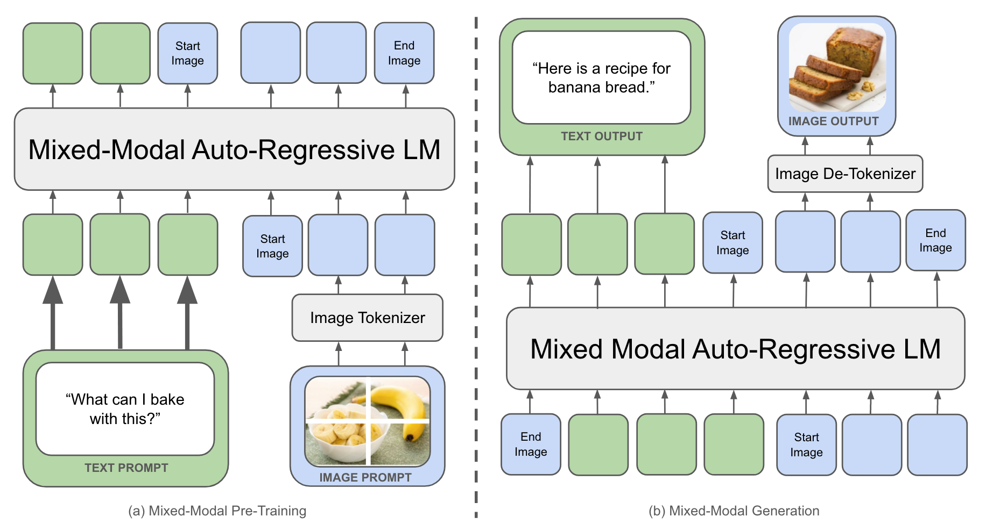

* Resolving Stability Issues
    * Observed training instability in multimodal settings and attributes this to "competition between modalities". This seem to be problematic for larger models and long training runs, and creates stability issues once norms reach the bf16 floating point limit. Often happens at the end of the training.
    * Query-Key normalization solves the issue of norm growth in attention
    * Moving Layernorms outside the attention and MLP helps bounds the norm growth of the feedforward block
    * Regularized the partition function Z of the softmax function by adding 10e−5 log^2 Z to the loss function
    * Dropout: For Chameleon-7B it was important to use both dropout and z-loss to achieve stability, while Chameleon-34B only required z-loss

* Inference Challenges 
    * Data dependencies per-step: image and text each have their own decoding methods, tokens must be inspected at each step (i.e. copied from the GPU to the CPU in a blocking fashion) to guide control flow. 
        * However, no specific details about how this was done 
    * Constrained generation masking: for exclusive generation for a particular modality (e.g. image-only generation), tokens that do not fall in a particular modality space must be masked and ignored when de-tokenizing.
    * Fixed-sized text units: unlike text-only generation, which is inherently variable-length, token-based image generation produces fixed-size blocks of tokens corresponding to an image.
    * Thier inference implementation supports streaming for both text and images. When generating in a streaming fashion, token-dependent conditional logic is needed at each generation step. Without streaming, however, blocks of image tokens can be generated in a fused fashion without conditional computation. 

**Evaluation**
* Human evaluation in prompt generation
    * Generated diverse and natural prompts from human annotators
    * Evaluated prompts and filterd out unclear prompts and prompts that don't expect mixed-modal responses, about 1,048 prompts: 441 (42.1%) mixed-modal, and 607 (57.9%) text-only.
* Benchmarks 
    * Absolute evaluation where judges mark whether responses fulfills/partially fulfills/does not fulfill the task 
* Competing methods
    * Augmenting GPT-4V and Gemini's responses with images. Instructed models togenrate image captions by text. 

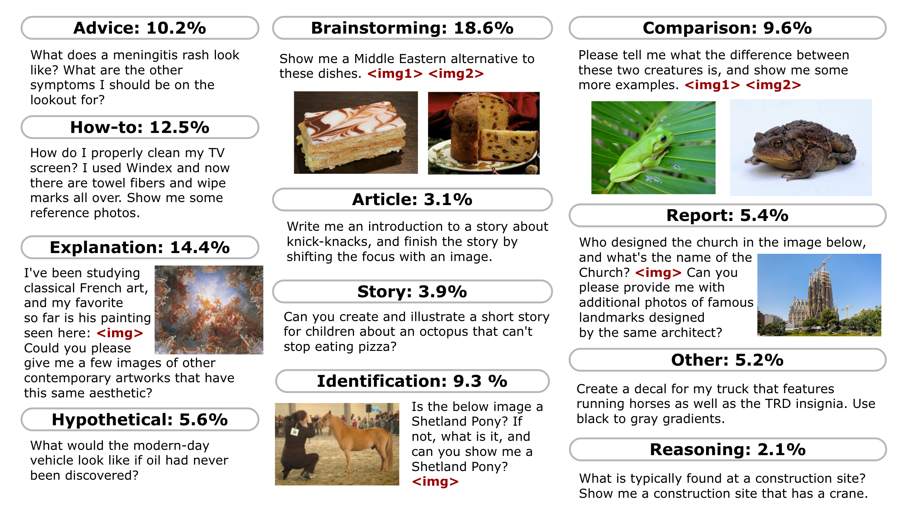

**Discussion**
* Strengths
    * Demonstrated the possibility of scaling early-fusion VLM for generating interleaved text and images
    * Early fusion model have a simple design space without worrying about modality specific encoders and allows seamless integation across modalities
    * Introduced techniques for stable training of super large models
    * Performed human evaluation 
* Weakness
    * Comparing with non-native mixed-modality models does not benchmark the Chameleon's performance in a convincing way
    * Comparing with Flamingo, InternVL, etc., experiments contain fewer tasks and datasets 
    * Some data used in training are licensed 

## GLIGEN

**Related Works**
* Large scale text-to-image generation models
    * Autoregressive approaches
        * DALL-E is one of the breakthrough works that demonstrates zero-shot abilities
        * Parti demonstrates the feasibility of scaling up autoregressive models
    * Diffusion approaches
        * Diffusion models require fewer parameters in general
* Closed-vocabulary grounded image generation
    * Layout2lm (2019): object labels and bounding boes are each encoded separately, fused together, and decoded into a single image. Used VAE encoder-decoder and LSTM 'fuser'
    * lostGAN/ALAMA (2019/2021): GAN converts bounding boxes to masks then converts masks to image
    * Make-a-Scene (2022): Semantic map converted to [scene] tokens using VAE (VQ-SEG). Transformer network then generates [image] tokens from [text] and [scene] tokens
* Open-vocabulary Gounded Image Generation 
    * eDiff-I (2022): Noted that image structure conditioned on text is established early on in denoisinig process, while later steps mostly focus on image refinement and ignore textual conditoning. Leverages this finding to train unique score networks for different segments of the denoising process. Used a training-free cross-attention approach for integrating semantic map grounding 
    * Reco (2023): concatenates textual embedding with bounding box locations and latent descriptions. Finetunes stable diffusion on augmented conditioning 
    * Sketch-guided text-to-image diffusion models: a universal approach to guide a pretrianed text-to-image diffusion model. A spatial map from another domain is added during inference time. However, there is no semantic understanding of the grounding input. 
    * ControlNet: enhance pre-trained text-to-image diffusion models by adding spatial conditioning controls.
        * adds an identical copy of the encoder block 
        * simpler integration but less general than GLIGEN 
        * GLIGEN uses a concatenation-based approach, making it more general and flexible, while ControlNet uses a sum-based approach, focusing a spatial alignment

**Approach**
* **Prelim: Stable Diffusion** adds VAE to the standard diffusion process and do diffusion on the latent image representation, and CLIP encodes caption on which diffusion process is additionally conditioned 
* From closed-set to open-set setting:
    * closed-set is a dictionary look-up problem
    * if we have a text encoder trained on all text data, we should be able to extend to open-set 

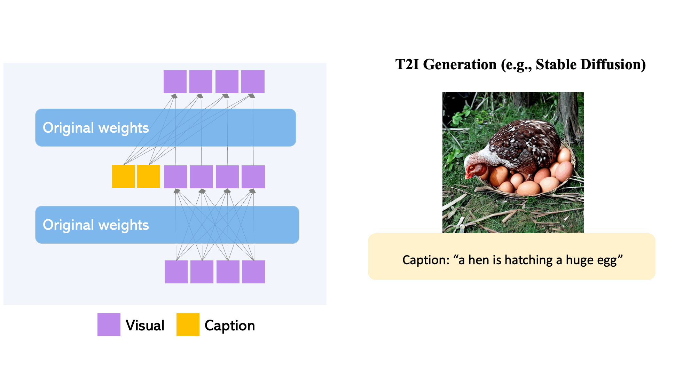

* How aditional grounding input can be instructed? **Grounding instruction input**
    * instruction: $y = (c, e)$ with
    * captions $c$ (language tokens)
    * grounding $e = [(e_1, l_1),..]$:  
        * semantic information: $e$ (what objects are being represented)
            * Assuming text entity 
        * spatial information: $l$ (where are the objects)
            * Assume bounding box: $l=[\alpha_{min}, \beta_{min}, \alpha_{max}, \beta_{max}]$
        * grounding tokens representation: a trick using Fourier embedding for attention learning 
    * Scheduled sampling: helps in extending keypoints which was only seen in initial time steps and in later steps image quality improves further

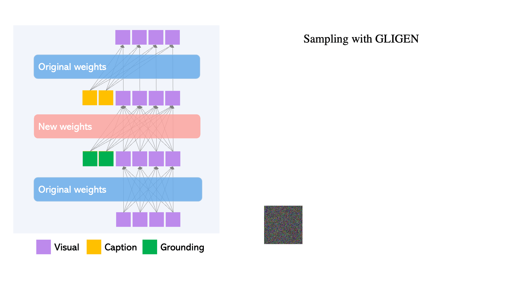

* How could we efficiently train the condition model?  **Continual Learning**
    * The objective is to add new spatial grounding capabilities to existing large language-to-image generation models
    * The key idea is to retain original model knowledge (due to high pre-training cost) by locking original weights and tune new modules for added capabilities 
        * freeze the 2 original attention layers
        * added a new gated self-attention layer
    * Attention mechanism
        $$v = v + \beta \tanh(\gamma)) * TS(SelfAttn([v, h^e]))$$
        * TS(.) token selection mechanism applied only to visual tokens. 
        * $\gamma$ learnable scalar initialized to 0, indicates importance of the condition
        * $\beta$ set to 1 during training and varied during inference for better quality control for scheduled sampling
        * Intuition: the gated self-attention allows visual features to leverage conditional information, and the resulting grounded features are treated as a residual, whose gate is initially set to 0. Note that a similar idea is used in Flamingo; however, it uses gated cross-attention.
        * Comparison with Flamingo
            * Better feature integration. 
                * Self-attention blends visual and grounding tokens more naturally
                * cross-attention keeps modalities dinstict, limiting fusion
            *

* What other approaches dealing with different types of grounding? 
    * image prompt: $f_{image}(e)$
    * keypoints: $l=[x, y]$
    * spatially-aligned conditions: edge map, depth map, normal map, etc. 

**Discussion**
* Gated self-attention mechanism helps to "re-position" visual features in the latent space based on the grounding information. This re-positioning facilitated by the attention weights learned within the self-attention mechanism makes the subsequent cross-attention with the caption more effective.
* Strengths
    * Simple architecture that can be easily used for other models
    * Works with wide variety of grounding inputs
    * Gated attention blocks prevent grounding from decreasing preformance
* Weaknesses
    * Lack results on complicated compositions with multiple objects

# Interesting Applications

## WebGUM

See [website](https://sites.google.com/view/mm-webnav/) and [paper](https://arxiv.org/abs/2305.11854).

**Problem Definition**
* Autonomous web navigation is a sequential decision making problem where the agent controls computers or crawls the Internet on the browser to satisfy given instructions.
* Develop a model that takes in a command for a web-based task via a natural language instruction (e.g., in an email client, Find Gisele's email and forward it to Siana, please.) and uses multimodal observations to complete the task via a sequence of computer actions such as click and type.

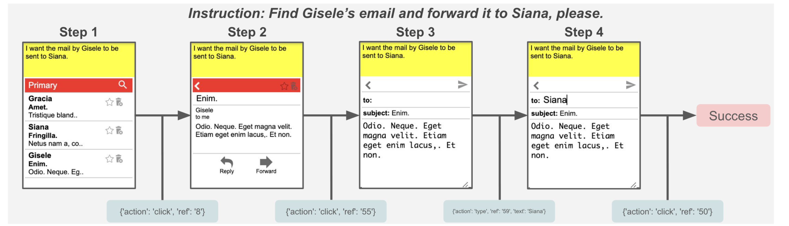

**Related Works**
* Online RL for web navigation:
    * Represents web page as DOM tree. 
    * Trains a mchine policy, providing a reward when the netowrk chooses a good action
    * Limitations:
        * Safety: Requires online interaction, which can be dangerous
        * Data hungry; Needs large amount of data with trial and errors 
        * Usually policy networks are tiny because you need to do lots of forward passes. So it is difficult to put a large VLM model in this framework
        * Most existing models lack generalization 
* VLM  
    * InstructGPT + Zero shot
        * Fine-tuned GPT-3 to better follow instructions
        * Usese RL from human Feedback
        * Competitive with online RL approaches
    * SeeClick
        * Purely vision based GUI agent, focuses on GUI grounding
        * Actions are click and rotation
        * Trained on 2.8K images

**Approach**
* Definition:
    * Given a State Space $S$, action space $A$, transition function $T: S \cross A -> S$, an instruction space $G$ in the format of a prompt
    * Define a reward function $r: S \cross G \cross A \in \{0,1\}$ 
    * We learn a polic $\piy: S_t \cross A_t \cross G$, which tells how we are deciding the actions
* Models   
    * Vision encoder: pretrained ViT
        * Not sure why used ImageNet pretrained not CLIP or other, that may have better multi-modal capabilities
        * Generate tempoeral and local tokens with ViT
            * 2 temporal tokens per patch via history of screenshots
            * 1 local token per patch rather than CLS token
    * Multimodal encoder-decoder: Flan-T5
        * T5 is the best performing for HTML data 
        * Using instruction tuned LLM because web navigation is inherently an instruction following task
        * Why used encoder-decoder? Usually, encoder-decoder is used to pretrain on a generation task. Then, papers uses the pre-trained encoder and fine-tune it on classification. 
* Training process
    * Fine-tuned model on their web navigation data 
* Generating data
    * Only 12k episodes publicly available for MiniWoB++
    * Generated 2.8k episodes using an existing LLM policy
    * Used this to fine-tune Flan-T5-XL to generate 10k episodes per task
    * Collects successes into 347k dataset

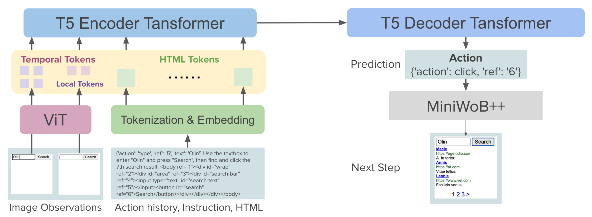

**Takeaways and Summary**
* Discusssion
    * Benefit of multimodality (HTML + screenshots) vs. just raw HTML.
        * Ablations on HTML, HTML + Image (white) + Image (random) + Image (real) shows that even when you add a white image, the performance goes up. Why? Maybe because more parameters are added?
    * Significant improvements when scaling up both dataset size and model size 
    * Decision making over long-horizon is still an unsolved problem
* Strengths
    * Significant improvement on existing datasets and benchmarks (offline training)
* Weaknesses
    * Limited applications to real-world still
    * Faily expensive given the relatively small scale 

    

