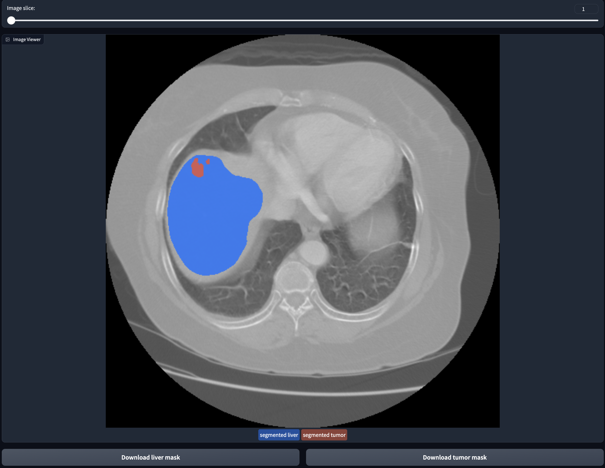
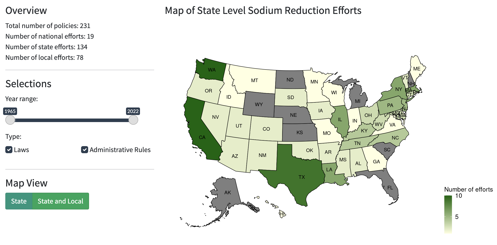
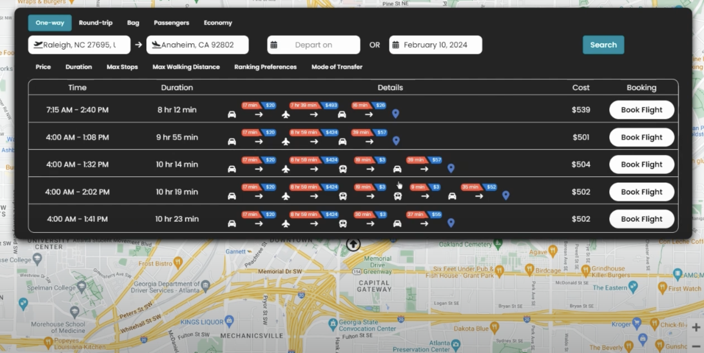
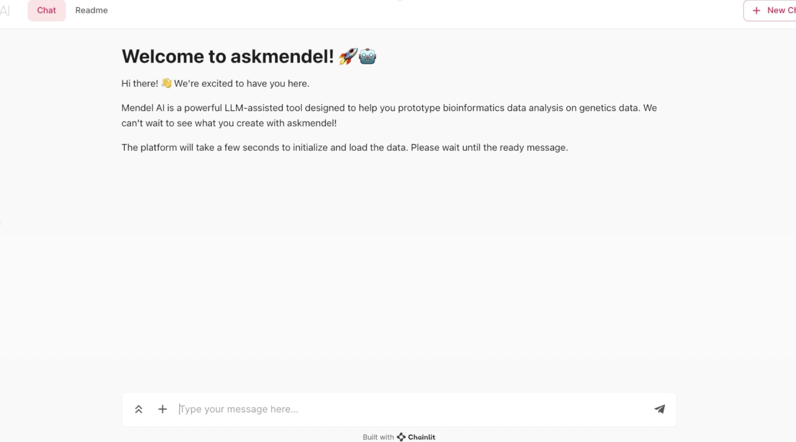

Beyond research, I enjoy building AI/ML tools that streamline data access and analysis, or offer practical solutions to everyday challenges. Here are a few of my favorites:

#### **MedAssist-Liver: an AI-powered Tool for Automated Liver Tumor Analysis**. 

This web application supports automated liver tumor segmentation from CT scans using deep learning, and automated diagnosis report generation using large language models (LLM). See [website](https://lingchmao-medassist-liver-cancer.hf.space/) and [paper](https://arxiv.org/abs/2410.10005).

*🏆 Winner, IISE DAIS Data Analytics Competition 2024*

#### **Sodium Reduction Policies in the U.S**

This project compiled sodium reduction policies and laws in the U.S. from 1965 to 2022. This interactive dashboard allows users to analyze and visualize the distribution of policies by category, geographical region, and relationship with local sociodemographics. See [website](https://us-sodium-policies.shinyapps.io/Rshiny/).

#### **MMTrip, Your Personalized Multi-modal Routing Planner**. 
This trip planning app provides door-to-door routes optimizing through all multimodal combinations of flights, public transit, driving, biking, and walking. Trips can be personalized via user-defined preferences/constraints. Accurate cost projections powered by real-time APIs and machine learning predictions. Here is a [demo](https://youtu.be/g0p3DScMEJs?feature=shared). Our [website](https://mmtrips.com) will be published once we receive funding support. 

*🏆 Winner, IISE DAIS Mobile/Web App Competition 2024*

#### **AskMendel, a LLM Assistant for Bioinformatics Data Analysis and Visualization.**

This chatbot assistant performs automated analysis of single cell RNA-seq data generating analysis plan, python code, and figures given users’ biological question. This is a startup project led by Dr. Assaf Magen, former Assistant Professor at Precision Immunology Institute. See [website](https://askmendel.ai/).

<!-- pages/projects.md -->
<!--


  
  <h2 class="category">{{ category }}</h2>
  
  
  
  
  

    

    
      
    
    

  

  
  

    
      
    
  

  
  


  
  
  
  

    

    
      
    
    

  

  
  

    
      
    
  

  


-->